# Diagram Autentykacji - WordRepeater AI

## Przepływ autentykacji w aplikacji

Ten dokument zawiera szczegółowy diagram sekwencyjny przedstawiający przepływ autentykacji w aplikacji WordRepeater AI wykorzystującej Astro, React i Supabase Auth.

## Diagram: Pełny cykl życia autentykacji

```mermaid
sequenceDiagram
    autonumber
    participant P as Przeglądarka
    participant M as Middleware
    participant API as Astro API
    participant S as Supabase Auth

    Note over P,S: REJESTRACJA UŻYTKOWNIKA

    P->>P: Użytkownik wypełnia formularz rejestracji
    P->>API: POST /api/auth/register
    Note right of P: email, hasło, akceptacja regulaminu
    
    API->>API: Walidacja danych (Zod schema)
    
    alt Dane nieprawidłowe
        API-->>P: 400 Bad Request
        Note right of API: Błędy walidacji
        P->>P: Wyświetl błędy użytkownikowi
    else Dane prawidłowe
        API->>S: signUp(email, password)
        
        alt Email już istnieje
            S-->>API: Błąd: Email zajęty
            API-->>P: 409 Conflict
            P->>P: Komunikat: Email już zarejestrowany
        else Sukces rejestracji
            S->>S: Hashowanie hasła (bcrypt)
            S->>S: Tworzenie użytkownika
            S-->>API: Użytkownik utworzony
            API->>API: Logowanie do audit_logs
            API-->>P: 201 Created
            P->>P: Komunikat: Rejestracja udana
            P->>P: Przekierowanie do /login (2s)
        end
    end

    Note over P,S: LOGOWANIE UŻYTKOWNIKA

    P->>P: Użytkownik otwiera /login
    P->>API: GET /login
    M->>M: Sprawdzenie sesji w cookies
    
    alt Użytkownik już zalogowany
        M->>P: Przekierowanie do /dashboard
    else Brak sesji
        M->>P: Renderowanie strony /login
    end
    
    P->>P: Wypełnienie formularza logowania
    P->>API: POST /api/auth/login
    Note right of P: email, hasło
    
    API->>API: Walidacja danych
    API->>S: signInWithPassword(email, password)
    
    alt Nieprawidłowe dane
        S-->>API: Błąd autentykacji
        API->>API: Logowanie nieudanej próby
        Note right of API: Rate limiting: 5 prób / 15 min
        API-->>P: 401 Unauthorized
        P->>P: Komunikat: Nieprawidłowy email lub hasło
    else Prawidłowe dane
        S->>S: Weryfikacja hasła
        S->>S: Generowanie access token (JWT, 1h)
        S->>S: Generowanie refresh token (30 dni)
        S-->>API: Session (access + refresh token)
        
        API->>API: Ustawienie cookies
        Note right of API: sb-access-token (HttpOnly, Secure)<br/>sb-refresh-token (HttpOnly, Secure)
        
        API->>API: Logowanie do audit_logs
        API-->>P: 200 OK + Set-Cookie headers
        
        P->>P: Przekierowanie do /dashboard
    end

    Note over P,S: DOSTĘP DO CHRONIONEJ STRONY

    P->>M: GET /dashboard (z cookies)
    M->>M: Odczyt tokenów z cookies
    Note right of M: sb-access-token<br/>sb-refresh-token
    
    alt Brak tokenów
        M->>P: Przekierowanie do /login?redirect=/dashboard
    else Tokeny obecne
        M->>S: setSession(access_token, refresh_token)
        
        alt Access token ważny
            S->>S: Weryfikacja JWT signature
            S->>S: Sprawdzenie expiry
            S-->>M: Session valid
            M->>M: Wstrzyknięcie user do locals
            Note right of M: locals.user<br/>locals.session
            M->>P: Renderowanie /dashboard
        else Access token wygasł
            S->>S: Próba odświeżenia z refresh token
            
            alt Refresh token ważny
                S->>S: Generowanie nowego access token
                S->>S: Rotacja refresh token (opcjonalnie)
                S-->>M: Nowa sesja
                M->>M: Aktualizacja cookies
                Note right of M: Nowe tokeny w cookies
                M->>M: Wstrzyknięcie user do locals
                M->>P: Renderowanie /dashboard
            else Refresh token nieważny
                M->>M: Usunięcie cookies
                M->>P: Przekierowanie do /login?redirect=/dashboard
            end
        end
    end

    Note over P,S: ŻĄDANIE API Z AUTORYZACJĄ

    P->>API: GET /api/flashcards
    Note right of P: Żądanie z cookies
    
    M->>M: Walidacja sesji (jak wyżej)
    
    alt Sesja nieważna
        M-->>P: 401 Unauthorized
        P->>P: Przekierowanie do /login
    else Sesja ważna
        M->>API: Przekazanie żądania (locals.user)
        API->>API: Weryfikacja locals.user
        
        alt Brak user w locals
            API-->>P: 401 Unauthorized
        else User zweryfikowany
            API->>API: Pobieranie fiszek dla user.id
            Note right of API: Tylko fiszki użytkownika
            API-->>P: 200 OK + dane fiszek
        end
    end

    Note over P,S: WYLOGOWANIE

    P->>P: Użytkownik klika "Logout"
    P->>API: POST /api/auth/logout
    
    API->>API: Weryfikacja sesji w locals
    
    alt Brak sesji
        API-->>P: 200 OK (już wylogowany)
    else Sesja aktywna
        API->>API: Logowanie do audit_logs
        API->>S: signOut()
        S->>S: Unieważnienie tokenów
        S-->>API: Sukces
        
        API->>API: Usunięcie cookies
        Note right of API: Delete sb-access-token<br/>Delete sb-refresh-token
        
        API-->>P: 200 OK
    end
    
    P->>P: Przekierowanie do /login

    Note over P,S: RESET HASŁA

    P->>P: Użytkownik klika "Forgot password"
    P->>P: Przekierowanie do /forgot-password
    P->>P: Wypełnienie formularza (email)
    P->>API: POST /api/auth/forgot-password
    
    API->>API: Walidacja email
    API->>S: resetPasswordForEmail(email)
    
    Note right of S: Rate limiting: 3 próby / 1h
    
    S->>S: Generowanie tokenu resetującego (JWT, 1h)
    S->>S: Wysyłanie emaila
    Note right of S: Link: /reset-password?token=...
    S-->>API: Sukces (zawsze, dla bezpieczeństwa)
    
    API-->>P: 200 OK
    P->>P: Komunikat: Sprawdź email
    
    Note over P,S: Użytkownik klika link w emailu
    
    P->>M: GET /reset-password?token=xyz
    M->>P: Renderowanie formularza reset hasła
    
    P->>P: Wypełnienie formularza (nowe hasło)
    P->>API: POST /api/auth/reset-password
    Note right of P: token, nowe hasło
    
    API->>API: Walidacja hasła (złożoność)
    API->>S: updateUser(token, new_password)
    
    alt Token nieważny/wygasły
        S-->>API: Błąd: Invalid token
        API-->>P: 400 Bad Request
        P->>P: Komunikat: Link wygasł
    else Token ważny
        S->>S: Weryfikacja tokenu (JWT)
        S->>S: Hashowanie nowego hasła
        S->>S: Aktualizacja hasła
        S->>S: Unieważnienie wszystkich sesji
        S-->>API: Sukces
        
        API->>API: Logowanie do audit_logs
        API-->>P: 200 OK
        
        P->>P: Komunikat: Hasło zmienione
        P->>P: Przekierowanie do /login (2s)
    end

    Note over P,S: USUNIĘCIE KONTA (GDPR)

    P->>P: Użytkownik otwiera menu użytkownika
    P->>P: Klika "Delete Account"
    P->>P: Modal: Wpisz "DELETE" dla potwierdzenia
    P->>API: POST /api/auth/delete-account
    Note right of P: confirmationText: "DELETE"
    
    API->>API: Weryfikacja sesji
    
    alt Brak sesji
        API-->>P: 401 Unauthorized
    else Sesja aktywna
        API->>API: Walidacja confirmation text
        
        alt Nieprawidłowe potwierdzenie
            API-->>P: 400 Bad Request
        else Potwierdzenie poprawne
            API->>API: Soft delete fiszek (deleted_at)
            Note right of API: UPDATE flashcards<br/>SET deleted_at = NOW()
            
            API->>API: Logowanie do audit_logs
            Note right of API: user_account_deleted
            
            API->>S: admin.deleteUser(user_id)
            Note right of S: Hard delete - usuwa PII
            
            S->>S: Usunięcie użytkownika
            S->>S: Usunięcie email (PII)
            S->>S: Usunięcie hasła
            S-->>API: Sukces
            
            API->>API: Usunięcie cookies
            API-->>P: 200 OK
            
            P->>P: Przekierowanie do /goodbye
        end
    end

    Note over P,S: WYGAŚNIĘCIE SESJI

    P->>M: GET /dashboard (po długim czasie)
    M->>M: Odczyt tokenów z cookies
    M->>S: setSession(access_token, refresh_token)
    
    S->>S: Weryfikacja access token (wygasły)
    S->>S: Próba użycia refresh token (też wygasły)
    S-->>M: Błąd: Invalid session
    
    M->>M: Usunięcie cookies
    M->>P: Przekierowanie do /login?redirect=/dashboard
    P->>P: Komunikat: Sesja wygasła
```



## Kluczowe elementy diagramu

### Aktorzy
- **Przeglądarka**: Frontend aplikacji (Astro + React)
- **Middleware**: Warstwa walidacji sesji (src/middleware/index.ts)
- **Astro API**: Endpointy autentykacji (/api/auth/*)
- **Supabase Auth**: Zewnętrzny serwis autentykacji

### Przepływy
1. **Rejestracja** - Tworzenie nowego konta użytkownika
2. **Logowanie** - Uwierzytelnianie i tworzenie sesji
3. **Dostęp do chronionej strony** - Weryfikacja sesji przez middleware
4. **Żądanie API** - Autoryzacja żądań do API
5. **Wylogowanie** - Zakończenie sesji
6. **Reset hasła** - Proces odzyskiwania hasła
7. **Usunięcie konta** - Zgodność z GDPR (prawo do bycia zapomnianym)
8. **Wygaśnięcie sesji** - Obsługa nieważnych tokenów

### Mechanizmy bezpieczeństwa

#### Cookies
- `sb-access-token` (1 godzina ważności)
  - HttpOnly: tak (ochrona przed XSS)
  - Secure: tak (tylko HTTPS)
  - SameSite: Lax (ochrona przed CSRF)

- `sb-refresh-token` (30 dni ważności)
  - HttpOnly: tak
  - Secure: tak
  - SameSite: Lax

#### Walidacja
- Client-side: Zod schemas
- Server-side: Zod schemas + Supabase Auth
- Hasło: min 8 znaków, 1 duża, 1 mała, 1 cyfra, 1 znak specjalny

#### Rate Limiting
- Logowanie: 5 prób / 15 minut na IP
- Reset hasła: 3 żądania / 1 godzina na email
- Rejestracja: 10 żądań / 1 godzina na IP

#### GDPR
- Hard delete: użytkownik z Supabase Auth (PII)
- Soft delete: fiszki (anonymized, user_id orphaned)
- Audit logs: zachowane ale bez możliwości powiązania z PII

### Odświeżanie tokenów

Token refresh dzieje się automatycznie w middleware:

1. Middleware odczytuje tokeny z cookies
2. Wywołuje `supabase.auth.setSession()`
3. Jeśli access token wygasł:
   - Supabase używa refresh token do wygenerowania nowego access token
   - Middleware aktualizuje cookies nowymi tokenami
   - Żądanie kontynuowane z ważną sesją
4. Jeśli refresh token też wygasł:
   - Sesja nieważna
   - Przekierowanie do /login

### Punkty przekierowania

1. **Zalogowany → /login**: Przekierowanie do /dashboard
2. **Niezalogowany → /dashboard**: Przekierowanie do /login?redirect=/dashboard
3. **Po rejestracji**: Przekierowanie do /login
4. **Po wylogowaniu**: Przekierowanie do /login
5. **Po usunięciu konta**: Przekierowanie do /goodbye
6. **Sesja wygasła**: Przekierowanie do /login z parametrem redirect

## Endpointy API

| Metoda | Endpoint | Autentykacja | Opis |
|--------|----------|--------------|------|
| POST | `/api/auth/register` | Nie | Rejestracja nowego użytkownika |
| POST | `/api/auth/login` | Nie | Logowanie użytkownika |
| POST | `/api/auth/logout` | Tak | Wylogowanie użytkownika |
| POST | `/api/auth/forgot-password` | Nie | Żądanie resetu hasła |
| POST | `/api/auth/reset-password` | Nie | Potwierdzenie resetu hasła |
| POST | `/api/auth/delete-account` | Tak | Usunięcie konta (GDPR) |

## Struktura plików

### Frontend
```
src/
├── components/
│   └── auth/
│       ├── LoginForm.tsx
│       ├── RegisterForm.tsx
│       ├── ForgotPasswordForm.tsx
│       ├── ResetPasswordForm.tsx
│       └── DeleteAccountModal.tsx
├── pages/
│   ├── login.astro
│   ├── register.astro
│   ├── forgot-password.astro
│   └── reset-password.astro
```

### Backend
```
src/
├── middleware/
│   └── index.ts (walidacja sesji)
├── pages/
│   └── api/
│       └── auth/
│           ├── register.ts
│           ├── login.ts
│           ├── logout.ts
│           ├── forgot-password.ts
│           ├── reset-password.ts
│           └── delete-account.ts
└── lib/
    ├── services/
    │   ├── authService.ts
    │   └── auditLogService.ts
    └── validation/
        └── authSchemas.ts
```

## Zmienne środowiskowe

```bash
SUPABASE_URL=https://your-project.supabase.co
SUPABASE_KEY=your-anon-key
SUPABASE_SERVICE_ROLE_KEY=your-service-role-key
PUBLIC_APP_URL=http://localhost:3000
```

## Zgodność z wymaganiami

Diagram pokrywa wszystkie wymagania z PRD:
- ✅ US-001: Rejestracja konta
- ✅ US-002: Logowanie
- ✅ US-003: Wylogowanie i wygaśnięcie sesji
- ✅ US-004: Usunięcie konta (GDPR)
- ✅ RF-017: Rejestracja i logowanie (email + hasło)
- ✅ RF-018: Reset hasła przez email
- ✅ RF-019: Autentykacja sesji i automatyczne wylogowanie
- ✅ RF-020: GDPR - zgoda, dostęp do danych, usunięcie konta

## Notatki implementacyjne

1. **Middleware** jest kluczowy - waliduje sesję na każdym żądaniu
2. **Cookies HttpOnly** chronią przed XSS
3. **SameSite=Lax** chroni przed CSRF
4. **Rate limiting** zapobiega brute force attacks
5. **Audit logs** rejestrują wszystkie zdarzenia auth
6. **HTTPS** jest wymagane w produkcji
7. **Token refresh** dzieje się automatycznie i transparentnie

