# Diagram Podróży Użytkownika - System Autentykacji WordRepeater AI

## Opis
Ten diagram przedstawia pełną podróż użytkownika przez system autentykacji aplikacji WordRepeater AI, obejmującą rejestrację, logowanie, odzyskiwanie hasła, zarządzanie sesją oraz usunięcie konta zgodnie z GDPR.

## Diagram

```mermaid
stateDiagram-v2
    [*] --> StronaGlowna
    
    StronaGlowna --> WyborAutentykacji: Użytkownik wchodzi
    
    state WyborAutentykacji <<choice>>
    WyborAutentykacji --> StronaLogowania: Ma konto
    WyborAutentykacji --> StronaRejestracji: Nie ma konta
    
    state "Proces Rejestracji" as ProcesRejestracji {
        [*] --> StronaRejestracji
        StronaRejestracji --> FormularzRejestracji
        
        note right of FormularzRejestracji
            Pola: email, hasło, potwierdzenie hasła
            Checkbox: akceptacja warunków i polityki prywatności
        end note
        
        FormularzRejestracji --> WalidacjaRejestracji: Wysłanie formularza
        
        WalidacjaRejestracji --> SprawdzenieEmail
        state SprawdzenieEmail <<choice>>
        SprawdzenieEmail --> BladDuplikatEmail: Email zajęty
        SprawdzenieEmail --> UtworzenieKonta: Email dostępny
        
        BladDuplikatEmail --> FormularzRejestracji: Wyświetl błąd
        
        UtworzenieKonta --> RozwidlenieRejestracji
        state RozwidlenieRejestracji <<fork>>
        RozwidlenieRejestracji --> ZapisWSupabase
        RozwidlenieRejestracji --> LogowanieAudit
        
        ZapisWSupabase --> PolaczenieProcesow
        LogowanieAudit --> PolaczenieProcesow
        state PolaczenieProcesow <<join>>
        
        PolaczenieProcesow --> KomunikatSukcesu
        KomunikatSukcesu --> [*]
    }
    
    ProcesRejestracji --> StronaLogowania: Przekierowanie po 2 sek
    
    state "Proces Logowania" as ProcesLogowania {
        [*] --> StronaLogowania
        
        note right of StronaLogowania
            Link do rejestracji
            Link do odzyskiwania hasła
        end note
        
        StronaLogowania --> FormularzLogowania
        FormularzLogowania --> WalidacjaLogowania: Wysłanie formularza
        
        WalidacjaLogowania --> SprawdzenieRateLimit
        state SprawdzenieRateLimit <<choice>>
        SprawdzenieRateLimit --> BladRateLimit: Za dużo prób (5 w 15 min)
        SprawdzenieRateLimit --> WeryfikacjaCredentials: OK
        
        BladRateLimit --> FormularzLogowania: Wyświetl błąd blokady
        
        WeryfikacjaCredentials --> DecyzjaLogowania
        state DecyzjaLogowania <<choice>>
        DecyzjaLogowania --> BladLogowania: Nieprawidłowe dane
        DecyzjaLogowania --> UtworzenSesji: Dane poprawne
        
        BladLogowania --> LogowanieNieudanejProby
        LogowanieNieudanejProby --> FormularzLogowania: Wyświetl błąd
        
        UtworzenSesji --> RozwidlenieLogowania
        state RozwidlenieLogowania <<fork>>
        RozwidlenieLogowania --> UstawienieCookies
        RozwidlenieLogowania --> LogowanieSukcesu
        
        UstawienieCookies --> PolaczenieSesji
        LogowanieSukcesu --> PolaczenieSesji
        state PolaczenieSesji <<join>>
        
        PolaczenieSesji --> [*]
    }
    
    ProcesLogowania --> Dashboard: Przekierowanie
    
    state "Proces Resetowania Hasła" as ProcesResetuHasla {
        [*] --> StronaZapomniałemHasła
        
        StronaZapomniałemHasła --> FormularzResetEmail
        FormularzResetEmail --> WyslanieZadaniaResetu: Wysłanie emaila
        
        note right of WyslanieZadaniaResetu
            Zawsze zwraca sukces (bezpieczeństwo)
            Nie ujawnia czy email istnieje
        end note
        
        WyslanieZadaniaResetu --> RozwidlenieResetu
        state RozwidlenieResetu <<fork>>
        RozwidlenieResetu --> WyslanieMailaResetu
        RozwidlenieResetu --> KomunikatWyslanoMail
        
        WyslanieMailaResetu --> PolaczenieMail
        KomunikatWyslanoMail --> PolaczenieMail
        state PolaczenieMail <<join>>
        
        PolaczenieMail --> CzekanieNaMail
        CzekanieNaMail --> KlikniecieLinkuWMailu
        
        KlikniecieLinkuWMailu --> StronaNowegoHasla
        StronaNowegoHasla --> FormularzNowegoHasla
        
        FormularzNowegoHasla --> WalidacjaTokenu
        state WalidacjaTokenu <<choice>>
        WalidacjaTokenu --> BladNieprawidlowyToken: Token nieprawidłowy/wygasły
        WalidacjaTokenu --> ZmianaHasla: Token OK
        
        BladNieprawidlowyToken --> StronaZapomniałemHasła: Żądanie nowego resetu
        
        ZmianaHasla --> RozwidlenieZmianyHasla
        state RozwidlenieZmianyHasla <<fork>>
        RozwidlenieZmianyHasla --> AktualizacjaHasla
        RozwidlenieZmianyHasla --> UniewaznienieSesji
        RozwidlenieZmianyHasla --> LogowanieResetuHasla
        
        AktualizacjaHasla --> PolaczenieResetu
        UniewaznienieSesji --> PolaczenieResetu
        LogowanieResetuHasla --> PolaczenieResetu
        state PolaczenieResetu <<join>>
        
        PolaczenieResetu --> KomunikatSukcesuResetu
        KomunikatSukcesuResetu --> [*]
    }
    
    ProcesResetuHasla --> StronaLogowania: Przekierowanie po 2 sek
    
    StronaLogowania --> ProcesResetuHasla: Link zapomniałem hasła
    
    state "Aplikacja (Zalogowany)" as AplikacjaZalogowana {
        [*] --> Dashboard
        
        note right of Dashboard
            Główny panel z CTA:
            - Generuj fiszki
            - Moje fiszki
            - Start nauki
        end note
        
        Dashboard --> GenerowanieFiszek: Przycisk Generuj
        Dashboard --> ListaFiszek: Przycisk Moje fiszki
        Dashboard --> SesjaNauki: Przycisk Start nauki
        
        GenerowanieFiszek --> Dashboard: Powrót
        ListaFiszek --> Dashboard: Powrót
        SesjaNauki --> Dashboard: Powrót
        
        Dashboard --> MenuUzytkownika: Kliknięcie menu
        
        state MenuUzytkownika {
            [*] --> WyswietlenieMenu
            WyswietlenieMenu --> DecyzjaMenu
            
            state DecyzjaMenu <<choice>>
            DecyzjaMenu --> Wylogowanie: Wyloguj
            DecyzjaMenu --> UsuniecieKonta: Usuń konto
            DecyzjaMenu --> [*]: Zamknij
        }
    }
    
    state "Proces Wylogowania" as ProcesWylogowania {
        [*] --> WywołanieAPIWylogowania
        
        WywołanieAPIWylogowania --> RozwidlenieWylogowania
        state RozwidlenieWylogowania <<fork>>
        RozwidlenieWylogowania --> WylogowanieZSupabase
        RozwidlenieWylogowania --> CzyszczenieCookies
        RozwidlenieWylogowania --> LogowanieWylogowania
        
        WylogowanieZSupabase --> PolaczenieWylogowania
        CzyszczenieCookies --> PolaczenieWylogowania
        LogowanieWylogowania --> PolaczenieWylogowania
        state PolaczenieWylogowania <<join>>
        
        PolaczenieWylogowania --> [*]
    }
    
    MenuUzytkownika --> ProcesWylogowania: Wyloguj
    ProcesWylogowania --> StronaLogowania: Przekierowanie
    
    state "Proces Usunięcia Konta (GDPR)" as ProcesUsunieciKonta {
        [*] --> ModalPotwierdzenia
        
        note right of ModalPotwierdzenia
            Ostrzeżenie o usunięciu danych
            Pole tekstowe: wpisz DELETE
            Przyciski: Anuluj / Usuń konto
        end note
        
        ModalPotwierdzenia --> WpisaniePotwierdzenia
        WpisaniePotwierdzenia --> WalidacjaPotwierdzenia
        
        state WalidacjaPotwierdzenia <<choice>>
        WalidacjaPotwierdzenia --> Anulowanie: Niepoprawne/Anuluj
        WalidacjaPotwierdzenia --> UsuwanieDanych: "DELETE" wpisane
        
        Anulowanie --> [*]
        
        UsuwanieDanych --> RozwidlenieUsuniecia
        state RozwidlenieUsuniecia <<fork>>
        RozwidlenieUsuniecia --> SoftDeleteFiszek
        RozwidlenieUsuniecia --> LogowanieUsuniecia
        
        SoftDeleteFiszek --> PolaczenieUsuniecia1
        LogowanieUsuniecia --> PolaczenieUsuniecia1
        state PolaczenieUsuniecia1 <<join>>
        
        PolaczenieUsuniecia1 --> HardDeleteUzytkownika
        HardDeleteUzytkownika --> CzyszczenieSesji
        CzyszczenieSesji --> [*]
    }
    
    MenuUzytkownika --> ProcesUsunieciKonta: Usuń konto
    ProcesUsunieciKonta --> StronaPoegnalna: Przekierowanie
    StronaPoegnalna --> [*]
    
    state "Middleware Walidacja Sesji" as MiddlewareWalidacja {
        [*] --> SprawdzenieTokenow
        
        note right of SprawdzenieTokenow
            Działa przy każdym żądaniu
            Sprawdza access_token i refresh_token
        end note
        
        SprawdzenieTokenow --> DecyzjaTokenow
        state DecyzjaTokenow <<choice>>
        DecyzjaTokenow --> BrakTokenow: Brak tokenów
        DecyzjaTokenow --> WalidacjaTokenow: Tokeny istnieją
        
        BrakTokenow --> SprawdzenieTrasy1
        
        WalidacjaTokenow --> DecyzjaWaznosci
        state DecyzjaWaznosci <<choice>>
        DecyzjaWaznosci --> TokenyNiewazne: Sesja wygasła
        DecyzjaWaznosci --> TokenyWazne: Sesja ważna
        
        TokenyNiewazne --> CzyszczenieNiewaznych
        CzyszczenieNiewaznych --> SprawdzenieTrasy1
        
        TokenyWazne --> SprawdzenieOdswiezenia
        state SprawdzenieOdswiezenia <<choice>>
        SprawdzenieOdswiezenia --> OdswieženieTokenow: Token wygasa
        SprawdzenieOdswiezenia --> UzycieIstniejacejSesji: Token świeży
        
        OdswieženieTokenow --> AktualizacjaCookies
        AktualizacjaCookies --> InjektowanieSesji
        
        UzycieIstniejacejSesji --> InjektowanieSesji
        
        InjektowanieSesji --> SprawdzenieTrasy2
        
        state SprawdzenieTrasy1 <<choice>>
        SprawdzenieTrasy1 --> PrzekierowaniDoLogin: Chroniona trasa
        SprawdzenieTrasy1 --> DostepPubliczny: Publiczna trasa
        
        state SprawdzenieTrasy2 <<choice>>
        SprawdzenieTrasy2 --> PrzekierowanoDoDashboard: Trasa /login lub /register
        SprawdzenieTrasy2 --> DostepZalogowany: Inna trasa
        
        PrzekierowaniDoLogin --> [*]
        PrzekierowanoDoDashboard --> [*]
        DostepPubliczny --> [*]
        DostepZalogowany --> [*]
    }
    
    AplikacjaZalogowana --> MiddlewareWalidacja: Każde żądanie
    MiddlewareWalidacja --> AplikacjaZalogowana: Sesja ważna
    MiddlewareWalidacja --> StronaLogowania: Sesja wygasła
    
    state "Obsługa Błędów" as ObslugaBledow {
        [*] --> RodzajBledu
        
        state RodzajBledu <<choice>>
        RodzajBledu --> BladSieciowy: Błąd sieci
        RodzajBledu --> BladWalidacji: Błąd walidacji
        RodzajBledu --> BladAutentykacji: Błąd autentykacji
        RodzajBledu --> BladRateLimiting: Za dużo prób
        
        BladSieciowy --> WyswietlenieKomunikatu1
        BladWalidacji --> WyswietlenieKomunikatu1
        BladAutentykacji --> WyswietlenieKomunikatu1
        BladRateLimiting --> WyswietlenieKomunikatu1
        
        WyswietlenieKomunikatu1 --> MozliwoscPonowienia
        
        state MozliwoscPonowienia <<choice>>
        MozliwoscPonowienia --> PrzyciskPonow: Błąd przejściowy
        MozliwoscPonowienia --> PowrotDoFormularza: Błąd walidacji
        
        PrzyciskPonow --> [*]
        PowrotDoFormularza --> [*]
    }
    
    Dashboard --> [*]: Koniec sesji
```

## Legenda

### Typy stanów:
- **Stany początkowe/końcowe:** `[*]`
- **Stany złożone:** Grupują powiązane procesy (np. Proces Rejestracji)
- **Punkty decyzyjne:** `<<choice>>` - miejsca gdzie ścieżka się rozgałęzia
- **Rozwidlenia równoległe:** `<<fork>>` i `<<join>>` - akcje wykonywane jednocześnie

### Kluczowe procesy:
1. **Proces Rejestracji:** Utworzenie nowego konta użytkownika
2. **Proces Logowania:** Autentykacja i utworzenie sesji
3. **Proces Resetowania Hasła:** Odzyskiwanie dostępu przez email
4. **Aplikacja (Zalogowany):** Główna funkcjonalność aplikacji
5. **Proces Wylogowania:** Zakończenie sesji użytkownika
6. **Proces Usunięcia Konta:** Usunięcie danych zgodnie z GDPR
7. **Middleware Walidacja Sesji:** Automatyczna ochrona tras i odświeżanie sesji
8. **Obsługa Błędów:** Graceful error handling dla różnych scenariuszy

### Zabezpieczenia:
- **Rate Limiting:** 5 prób logowania na 15 minut
- **HTTP-only cookies:** Zabezpieczenie przed XSS
- **SameSite=Lax:** Ochrona przed CSRF
- **Automatyczne odświeżanie tokenów:** Bezproblemowa sesja użytkownika
- **GDPR Compliance:** Soft delete fiszek + hard delete użytkownika

### Kluczowe decyzje biznesowe:
- Resetowanie hasła zawsze zwraca sukces (nie ujawnia czy email istnieje)
- Użytkownik zalogowany nie może wejść na /login lub /register
- Użytkownik niezalogowany jest przekierowywany na /login z parametrem redirect
- Middleware waliduje sesję przy każdym żądaniu
- Tokeny są automatycznie odświeżane bez przerywania UX

## Technologie
- **Backend:** Astro 5, TypeScript 5
- **Autentykacja:** Supabase Auth
- **Walidacja:** Zod schemas (client + server)
- **Session Management:** HTTP-only cookies (access_token + refresh_token)
- **Baza danych:** PostgreSQL (via Supabase)

## Zgodność z wymaganiami
Ten diagram obejmuje wszystkie user stories związane z autentykacją:
- ✅ US-001: Rejestracja konta
- ✅ US-002: Logowanie
- ✅ US-003: Wylogowanie i wygaśnięcie sesji
- ✅ US-004: Usunięcie konta (GDPR)

Oraz wymagania funkcjonalne:
- ✅ RF-017: Rejestracja i logowanie (email + hasło)
- ✅ RF-018: Reset hasła przez email
- ✅ RF-019: Autentykacja sesji i automatyczne wylogowanie
- ✅ RF-020: Zgodność z GDPR (akceptacja warunków, usunięcie konta)

