# Diagram Architektury UI - System Autentykacji

## Opis

Ten diagram przedstawia kompletną architekturę UI dla systemu autentykacji w aplikacji WordRepeater AI. Obejmuje strony publiczne (autentykacja), chronione strony (aplikacja), komponenty React, layouty, middleware, API endpoints oraz serwisy.

## Diagram

```mermaid
flowchart TD
    subgraph "Middleware"
        MW[Middleware Session Validation]
        MW --> MW1[Walidacja tokenów z cookies]
        MW --> MW2[Odświeżanie sesji]
        MW --> MW3[Inject user do Astro.locals]
        MW --> MW4[Przekierowania chronione/publiczne]
    end

    subgraph "Strony Publiczne - Autentykacja"
        LOGIN["/login - login.astro"]
        REGISTER["/register - register.astro"]
        FORGOT["/forgot-password - forgot-password.astro"]
        RESET["/reset-password - reset-password.astro"]

        LOGIN --> AUTHLAYOUT1[Używa AuthLayout]
        REGISTER --> AUTHLAYOUT2[Używa AuthLayout]
        FORGOT --> AUTHLAYOUT3[Używa AuthLayout]
        RESET --> AUTHLAYOUT4[Używa AuthLayout]
    end

    subgraph "Layouty"
        BASELAYOUT[Layout.astro - Bazowy layout]
        AUTHLAYOUT[AuthLayout.astro - Layout dla stron auth]
        APPLAYOUT[AppLayout.astro - Layout dla chronionych stron]

        AUTHLAYOUT --> BASELAYOUT
        APPLAYOUT --> BASELAYOUT
        APPLAYOUT --> APPNAV[AppNavigation.astro]
        APPLAYOUT --> USERMENU[UserMenu - React]
    end

    subgraph "Komponenty Formularzy Autentykacji - React"
        LOGINFORM[LoginForm.tsx]
        REGISTERFORM[RegisterForm.tsx]
        FORGOTFORM[ForgotPasswordForm.tsx]
        RESETFORM[ResetPasswordForm.tsx]
        DELETEMODAL[DeleteAccountModal.tsx]

        LOGINFORM --> FORMFIELD1[Używa FormField]
        REGISTERFORM --> FORMFIELD2[Używa FormField]
        REGISTERFORM --> PWDSTRENGTH[PasswordStrengthIndicator]
        FORGOTFORM --> FORMFIELD3[Używa FormField]
        RESETFORM --> FORMFIELD4[Używa FormField]
        RESETFORM --> PWDSTRENGTH2[PasswordStrengthIndicator]
    end

    subgraph "Komponenty UI Współdzielone"
        FORMFIELD[FormField.tsx - Uniwersalne pole formularza]
        PWDSTRENGTH[PasswordStrengthIndicator.tsx]
    end

    subgraph "Strony Chronione - Aplikacja"
        DASHBOARD["/dashboard - dashboard.astro"]
        GENERATE["/generate - generate.astro"]
        ACCEPT["/accept - accept.astro"]
        FLASHCARDS["/flashcards - index.astro"]
        NEWCARD["/flashcards/new - new.astro"]

        DASHBOARD --> APPLAYOUT1[Używa AppLayout]
        GENERATE --> APPLAYOUT2[Używa AppLayout]
        ACCEPT --> APPLAYOUT3[Używa AppLayout]
        FLASHCARDS --> APPLAYOUT4[Używa AppLayout]
        NEWCARD --> APPLAYOUT5[Używa AppLayout]
    end

    subgraph "Komponenty Aplikacji - React - Istniejące"
        DASHCONTENT[DashboardContent.tsx]
        GENFORM[GenerateFlashcardsForm.tsx]
        ACCEPTVIEW[AcceptFlashcardView.tsx]
        LISTPAGE[FlashcardListPage.tsx]
        MANUALFORM[ManualFlashcardForm.tsx]

        DASHCONTENT --> DASHCTA[DashboardCTAButtons.tsx]
        LISTPAGE --> FLASHTABLE[FlashcardTable.tsx]
        LISTPAGE --> EDITMODAL[EditModal.tsx]
        LISTPAGE --> DELMODAL[DeleteModal.tsx]
        LISTPAGE --> FILTERCHIPS[FilterChips.tsx]
        LISTPAGE --> PAGINATION[Pagination.tsx]
        ACCEPTVIEW --> FULLCARD[FullscreenCard.tsx]
        ACCEPTVIEW --> ACTIONBTNS[ActionButtons.tsx]
    end

    subgraph "API Endpoints - Autentykacja"
        API_REGISTER["/api/auth/register"]
        API_LOGIN["/api/auth/login"]
        API_LOGOUT["/api/auth/logout"]
        API_FORGOT["/api/auth/forgot-password"]
        API_RESET["/api/auth/reset-password"]
        API_DELETE["/api/auth/delete-account"]
    end

    subgraph "API Endpoints - Fiszki - Istniejące"
        API_FCLIST["/api/flashcards GET"]
        API_FCCREATE["/api/flashcards POST"]
        API_FCUPDATE["/api/flashcards/id PUT"]
        API_FCDELETE["/api/flashcards/id DELETE"]
        API_GENERATE["/api/flashcards/generate POST"]
        API_DECISION["/api/flashcards/id/decision POST"]
    end

    subgraph "Warstwa Serwisów"
        AUTHSVC[authService.ts - Nowy]
        FLASHSVC[flashcardService.ts - Istniejący]
        AUDITSVC[auditLogService.ts - Zaktualizowany]
        VALIDATION[authSchemas.ts - Walidacja Zod]

        AUTHSVC --> SUPABASE[Supabase Client]
        FLASHSVC --> SUPABASE
        AUDITSVC --> SUPABASE
    end

    subgraph "Baza Danych - Supabase"
        SUPABASE[Supabase Client]
        SUPAAUTH[Supabase Auth - Tabela users]
        FLASHTABLE_DB[Tabela flashcards]
        AUDITTABLE[Tabela audit_logs]

        SUPABASE --> SUPAAUTH
        SUPABASE --> FLASHTABLE_DB
        SUPABASE --> AUDITTABLE
    end

    MW -.->|Przekierowanie| LOGIN
    MW -.->|Przekierowanie| DASHBOARD

    LOGIN --> LOGINFORM
    REGISTER --> REGISTERFORM
    FORGOT --> FORGOTFORM
    RESET --> RESETFORM

    DASHBOARD --> DASHCONTENT
    GENERATE --> GENFORM
    ACCEPT --> ACCEPTVIEW
    FLASHCARDS --> LISTPAGE
    NEWCARD --> MANUALFORM

    USERMENU --> DELETEMODAL

    LOGINFORM -->|POST| API_LOGIN
    REGISTERFORM -->|POST| API_REGISTER
    FORGOTFORM -->|POST| API_FORGOT
    RESETFORM -->|POST| API_RESET
    DELETEMODAL -->|POST| API_DELETE
    USERMENU -->|POST| API_LOGOUT

    GENFORM -->|POST| API_GENERATE
    ACCEPTVIEW -->|POST| API_DECISION
    LISTPAGE -->|GET| API_FCLIST
    MANUALFORM -->|POST| API_FCCREATE
    EDITMODAL -->|PUT| API_FCUPDATE
    DELMODAL -->|DELETE| API_FCDELETE

    API_REGISTER --> AUTHSVC
    API_LOGIN --> AUTHSVC
    API_LOGOUT --> AUTHSVC
    API_FORGOT --> AUTHSVC
    API_RESET --> AUTHSVC
    API_DELETE --> AUTHSVC

    API_FCLIST --> FLASHSVC
    API_FCCREATE --> FLASHSVC
    API_FCUPDATE --> FLASHSVC
    API_FCDELETE --> FLASHSVC
    API_GENERATE --> FLASHSVC
    API_DECISION --> FLASHSVC

    AUTHSVC --> AUDITSVC
    FLASHSVC --> AUDITSVC

    API_REGISTER --> VALIDATION
    API_LOGIN --> VALIDATION
    API_RESET --> VALIDATION

    classDef newComponent fill:#22c55e,stroke:#16a34a,stroke-width:3px,color:#000;
    classDef existingComponent fill:#3b82f6,stroke:#2563eb,stroke-width:3px,color:#fff;
    classDef apiEndpoint fill:#f59e0b,stroke:#d97706,stroke-width:3px,color:#000;
    classDef service fill:#a855f7,stroke:#9333ea,stroke-width:3px,color:#fff;
    classDef database fill:#ef4444,stroke:#dc2626,stroke-width:3px,color:#fff;
    classDef middleware fill:#fb923c,stroke:#ea580c,stroke-width:3px,color:#000;

    class LOGINFORM,REGISTERFORM,FORGOTFORM,RESETFORM,DELETEMODAL,FORMFIELD,PWDSTRENGTH,AUTHSVC,VALIDATION,AUTHLAYOUT,APPLAYOUT,APPNAV,USERMENU,LOGIN,REGISTER,FORGOT,RESET newComponent;
    class DASHCONTENT,GENFORM,ACCEPTVIEW,LISTPAGE,MANUALFORM,FLASHTABLE,EDITMODAL,DELMODAL,FILTERCHIPS,PAGINATION,FULLCARD,ACTIONBTNS,DASHCTA,FLASHSVC,AUDITSVC,DASHBOARD,GENERATE,ACCEPT,FLASHCARDS,NEWCARD existingComponent;
    class API_REGISTER,API_LOGIN,API_LOGOUT,API_FORGOT,API_RESET,API_DELETE,API_FCLIST,API_FCCREATE,API_FCUPDATE,API_FCDELETE,API_GENERATE,API_DECISION apiEndpoint;
    class AUTHSVC,FLASHSVC,AUDITSVC,VALIDATION service;
    class SUPABASE,SUPAAUTH,FLASHTABLE_DB,AUDITTABLE database;
    class MW,MW1,MW2,MW3,MW4 middleware;
```

## Legenda

### Kolory komponentów (zoptymalizowane dla ciemnych motywów)

- **🟢 Zielony** (tekst czarny) - Nowe komponenty do implementacji (system autentykacji)
- **🔵 Niebieski** (tekst biały) - Istniejące komponenty (do aktualizacji lub bez zmian)
- **🟠 Pomarańczowy** (tekst czarny) - Endpointy API
- **🟣 Fioletowy** (tekst biały) - Warstwa serwisów
- **🔴 Czerwony** (tekst biały) - Baza danych (Supabase)
- **🟡 Pomarańczowy jasny** (tekst czarny) - Middleware

**Uwaga:** Kolory zostały dobrane z wysokim kontrastem dla lepszej czytelności w ciemnych motywach edytora.

### Typy połączeń

- **Linia ciągła ze strzałką (-->)** - Bezpośrednia zależność, użycie komponentu, przepływ danych
- **Linia kropkowana ze strzałką (-.->)** - Przekierowania, przepływ warunkowy

## Kluczowe Zmiany i Aktualizacje

### Nowe elementy (do implementacji):

1. **Strony autentykacji:** login.astro, register.astro, forgot-password.astro, reset-password.astro
2. **Komponenty formularzy:** LoginForm, RegisterForm, ForgotPasswordForm, ResetPasswordForm, DeleteAccountModal
3. **Komponenty UI:** FormField, PasswordStrengthIndicator
4. **Layouty:** AuthLayout, AppLayout
5. **Nawigacja:** AppNavigation, UserMenu
6. **API endpoints:** /api/auth/\* (6 endpointów)
7. **Serwisy:** authService.ts, authSchemas.ts (walidacja)
8. **Middleware:** Rozszerzenie o walidację sesji i przekierowania

### Aktualizacje istniejących elementów:

1. **Middleware (index.ts):** Dodanie walidacji sesji, odświeżania tokenów, przekierowań
2. **Istniejące strony:** Zmiana layoutu z Layout.astro na AppLayout.astro
3. **flashcardService.ts:** Dodanie parametru userId (usunięcie DEFAULT_USER)
4. **API flashcards:** Pobranie userId z Astro.locals.user zamiast DEFAULT_USER
5. **auditLogService.ts:** Dodanie nowych zdarzeń autentykacji

## Przepływ Autentykacji

### Rejestracja:

Użytkownik → /register → RegisterForm → POST /api/auth/register → authService → Supabase Auth → Email weryfikacyjny → Przekierowanie na /login

### Logowanie:

Użytkownik → /login → LoginForm → POST /api/auth/login → authService → Supabase Auth → Ustawienie cookies sesji → Przekierowanie na /dashboard

### Reset hasła:

Użytkownik → /forgot-password → ForgotPasswordForm → POST /api/auth/forgot-password → authService → Supabase Auth → Email z linkiem → /reset-password?token=X → ResetPasswordForm → POST /api/auth/reset-password → authService → Supabase Auth → Przekierowanie na /login

### Usunięcie konta:

Użytkownik zalogowany → UserMenu → Delete Account → DeleteAccountModal (potwierdzenie "DELETE") → POST /api/auth/delete-account → authService → Soft delete fiszek → Hard delete użytkownika z Supabase Auth → Wylogowanie → Przekierowanie

## Przepływ Middleware

### Dla użytkownika niezalogowanego:

Request → Middleware → Brak sesji → Próba dostępu do chronionej strony → Przekierowanie na /login?redirect=/intended-path

### Dla użytkownika zalogowanego:

Request → Middleware → Walidacja sesji → Odświeżanie tokenów (jeśli potrzebne) → Inject user/session do Astro.locals → Próba dostępu do /login lub /register → Przekierowanie na /dashboard

### Dla żądania API:

Request → Middleware → Walidacja sesji → Chroniony endpoint bez sesji → Zwrot 401 Unauthorized

## Bezpieczeństwo

1. **Middleware** - Walidacja sesji na każdym żądaniu
2. **HTTP-only cookies** - Zabezpieczenie przed XSS
3. **SameSite=Lax** - Ochrona przed CSRF
4. **Rate limiting** - Ograniczenie prób logowania (5/15 min)
5. **Walidacja Zod** - Client-side i server-side
6. **HTTPS** - Wymagane w produkcji
7. **Audit logs** - Śledzenie wszystkich zdarzeń autentykacji

## Zgodność z GDPR

- **Zgoda użytkownika:** Checkbox w RegisterForm z linkami do Terms i Privacy Policy
- **Prawo do usunięcia:** DeleteAccountModal - hard delete z Supabase Auth, soft delete fiszek
- **Prawo dostępu:** Użytkownik widzi swoje fiszki w FlashcardListPage
- **Minimalizacja danych:** Zbierane tylko email i hasło (zahashowane)
- **Audit trail:** Wszystkie operacje logowane w audit_logs (anonimizowane po usunięciu użytkownika)

## Notatki Implementacyjne

### Kolejność implementacji (wg faz z specyfikacji):

**Faza 1 - Core Authentication:**

- API endpoints: register, login, logout
- authService
- Komponenty: LoginForm, RegisterForm
- Strony: login.astro, register.astro
- Middleware: podstawowa walidacja sesji

**Faza 2 - Session Management:**

- Middleware: odświeżanie tokenów, przekierowania
- AuthLayout, AppLayout
- AppNavigation, UserMenu
- Aktualizacja istniejących stron

**Faza 3 - Password Recovery:**

- API endpoints: forgot-password, reset-password
- Komponenty: ForgotPasswordForm, ResetPasswordForm
- Strony: forgot-password.astro, reset-password.astro
- Konfiguracja email templates w Supabase

**Faza 4 - Account Deletion:**

- API endpoint: delete-account
- Komponent: DeleteAccountModal
- Integracja z UserMenu

**Faza 5 - Migration & Cleanup:**

- Usunięcie DEFAULT_USER
- Aktualizacja flashcardService (userId param)
- Aktualizacja wszystkich API flashcards
- Testy przepływów

**Faza 6 - Security Hardening:**

- Rate limiting
- Audit logging dla auth
- HTTPS redirect
- Security audit

**Faza 7 - Legal & Compliance:**

- Terms of Service
- Privacy Policy
- Cookie consent (jeśli wymagane)
